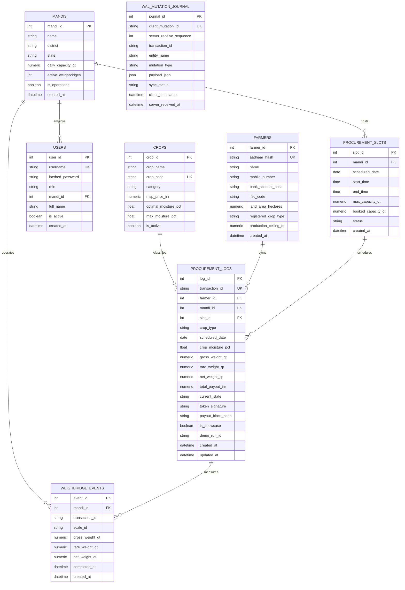

# MandiQ — Intelligent APMC Yard & Dynamic Queue Management Platform

**Problem Statement ID:** SIH1578  
**Theme:** Smart Automation / AgriTech / E-Governance  
**Classification:** Real-Time Offline-First APMC Logistics, Dynamic Perishability Queueing & Cryptographic DBT Settlement  
**Deployment Status:** Online Production (Vercel Frontend PWA + Render Managed Backend, PostgreSQL 16 & Redis 7.2)

---

## Quick Navigation

- [1. Project Overview](#1-project-overview)
- [2. Architectural Truth: Prototype vs. Production](#2-architectural-truth-prototype-vs-production)
- [3. Core Features](#3-core-features)
- [4. System Architecture](#4-system-architecture)
- [5. Frontend Architecture](#5-frontend-architecture)
- [6. Backend Architecture](#6-backend-architecture)
- [7. Database Architecture & Canonical Schema](#7-database-architecture--canonical-schema)
- [8. Offline-First Architecture & Write-Ahead Logging](#8-offline-first-architecture--write-ahead-logging)
- [9. Synchronization Model & Conflict Resolution](#9-synchronization-model--conflict-resolution)
- [10. Dynamic Crop Degradation Queue (DCDQ) Formulation](#10-dynamic-crop-degradation-queue-dcdq-formulation)
- [11. Redis Queue & Concurrency Infrastructure](#11-redis-queue--concurrency-infrastructure)
- [12. Background Processing](#12-background-processing)
- [13. Target Production Architecture](#13-target-production-architecture)
- [14. Security, Cryptography & Privacy](#14-security-cryptography--privacy)
- [15. End-to-End Procurement Workflow](#15-end-to-end-procurement-workflow)
- [16. REST API Reference](#16-rest-api-reference)
- [17. Repository Directory Structure](#17-repository-directory-structure)
- [18. Technology Stack](#18-technology-stack)
- [19. Local Development & Quick Start](#19-local-development--quick-start)
- [20. Production Cloud Deployment](#20-production-cloud-deployment)
- [21. Progressive Web App (PWA) & Mobile Installation](#21-progressive-web-app-pwa--mobile-installation)
- [22. Automated Verification & Testing Suites](#22-automated-verification--testing-suites)
- [23. Database Migrations Workflow](#23-database-migrations-workflow)
- [24. Scalability & Performance Model](#24-scalability--performance-model)
- [25. Failure Modes & Resilience Matrix](#25-failure-modes--resilience-matrix)
- [26. Known Limitations & Prototype Boundaries](#26-known-limitations--prototype-boundaries)
- [27. Architecture References & ADRs](#27-architecture-references--adrs)
- [28. Development & Contribution Governance](#28-development--contribution-governance)
- [29. Technical & Domain Glossary](#29-technical--domain-glossary)
- [30. Quick Start Cheat-Sheet](#30-quick-start-cheat-sheet)

---

## 1. Project Overview

Agricultural Produce Market Committee (APMC) procurement centers across India process billions of rupees in food grains annually. However, existing procurement operations suffer from structural operational bottlenecks:
1. **Unmanaged Yard Congestion:** Tractor-trolleys wait in unorganized physical queues outside mandi gates for 12 to 48 hours during peak harvest seasons.
2. **Post-Harvest Crop Degradation:** High-moisture grains (e.g., freshly harvested wheat or paddy) trapped in transit suffer fungal growth, rotting, and severe qualitative degradation while idling behind dry produce.
3. **Weighbridge Bottlenecks & Scale Fraud:** Manual scale entries, paper slips, and delayed tare re-weighing create vulnerabilities for weight manipulation and billing discrepancies.
4. **Delayed Payments:** Disconnected weighbridge, quality assaying, and payment systems lead to multi-week or multi-month delays in Direct Benefit Transfer (DBT) disbursement to smallholder farmers.
5. **Connectivity Fragility:** Mandis located in rural agricultural belts experience frequent, prolonged cellular and broadband outages. Cloud-only architectures fail completely during network blackouts.

**MandiQ** is an offline-resilient, dynamic queue dispatch, quality-based prioritization, and cryptographic ledger platform designed to solve these systemic procurement challenges. It replaces static First-Come, First-Served (FCFS) queues with an automated, multi-factor **Dynamic Crop Degradation Queue (DCDQ)**, provides client-side offline execution backed by IndexedDB and Write-Ahead Logging (WAL), enforces zero-plaintext Aadhaar anonymization, and stages dual-signature cryptographic authorizations for instant direct benefit payouts.

### Intended Stakeholders & Users
- **Smallholder & Commercial Farmers:** Dynamic hourly slot reservations, live queue tracking, moisture status alerts, and instant digital J-Form billing receipts via smartphone PWA or offline SMS/USSD.
- **Mandi Gate Operators:** Rapid offline-capable QR token scanning, gate pass generation, and arrival timestamp verification.
- **Quality Assaying Inspectors:** Deterministic grain grading against Food Corporation of India (FCI) and Bureau of Indian Standards (BIS) parameters, automated moisture penalty calculations, and drying-apron diversion routing.
- **Weighbridge Scale Operators:** Direct gross and tare weight ingestion with anti-tare fraud validation and dynamic vehicle queue advancement.
- **APMC Mandi Supervisors & Board Admins:** Real-time yard telemetry, hourly throughput monitoring, emergency moisture overrides, and cryptographic payment settlement staging.

---

## 2. Architectural Truth: Prototype vs. Production

To maintain strict engineering rigor, this repository explicitly distinguishes between the **currently implemented prototype baseline** and the **long-term production target architecture** specified in the Architectural Decision Records (ADRs).

| Architectural Dimension | Current Working Prototype (This Repository) | Long-Term Production Target (Enterprise Specification) |
|---|---|---|
| **System Topology** | Offline-First Modular Monolith (FastAPI + React PWA) | Hybrid Event-Driven Microservices + Offline Edge Nodes |
| **API Transport** | Synchronous REST (JSON over HTTP/HTTPS) with CORS | REST Commands + Apache Kafka Event Streaming (`mandi.events`) |
| **Event Coordination** | In-Memory Redis 7.2 coordination + Native FastAPI `BackgroundTasks` | Distributed Apache Kafka Clusters with consumer groups |
| **Active Queue Engine** | Redis Sorted Sets (`ZSET`) with in-memory deterministic fallback | Distributed Kafka Log Streams + Redis Read Replicas |
| **Concurrency Control** | Redis atomic `SET NX PX` locks (1500 ms TTL) + Lua release script | Distributed Consensus Locks (Redis Redlock / etcd) |
| **Background Daemons** | Single-process `BackgroundTasks` (strictly zero Kafka/RabbitMQ/Celery) | Celery / Temporal distributed background worker fleets |
| **Relational Database** | Managed PostgreSQL 16 (cloud) with transparent SQLite 3 fallback | High-Availability PostgreSQL with read-replicas & pgBouncer |
| **Database Partitioning** | Single relational tables with indexed foreign keys | Range-partitioned `procurement_logs` by `mandi_id` and harvest season |
| **Client Persistence** | IndexedDB via Dexie.js with transactional Write-Ahead Logging (`transactionsWAL`) | IndexedDB Dexie.js + Encrypted SQLite on rugged Android POS terminals |
| **Synchronization** | Gzip-compressed binary batch ingestion with Last-Write-Wins (LWW) merge | Monotonic Vector Clock / CRDT synchronization with cloud consensus |
| **Identity Verification** | Deterministic SHA-256 Aadhaar hashing + Mock eKYC verification endpoint | Direct UIDAI Aadhaar Vault API / DigiLocker OAuth integration |
| **DBT Payment Payout** | Server-side HMAC-SHA256 dual-signature hash chaining + Mock PFMS endpoint | Direct Public Financial Management System (PFMS) & NPCI AePS Gateway |
| **Hardware Integration** | Simulated digital weighbridge scale inputs & barcode scanner emulators | RS-232 / Modbus serial bus direct weighbridge hardware bridge |

---

## 3. Core Features

### 3.1 Farmer Identity & Land Production Ceiling Enforcement
- **What it does:** Verifies farmer identity and caps total grain procurement to their registered acreage yield ceiling.
- **Why it exists:** Prevents commercial traders from illegally exploiting smallholder Minimum Support Price (MSP) quotas (MSP arbitrage fraud).
- **How it is implemented:** Each farmer record links `land_area_hectares` to crop-specific productivity benchmarks ($Q_{\text{ceiling}} = \text{Land} \times \text{Yield}$). During slot booking and weighment, the backend executes an atomic lock (`FOR UPDATE` / atomic SQLite transaction) calculating cumulative deliveries ($\sum Q_{\text{delivered}} + Q_{\text{new}} \le Q_{\text{ceiling}}$). If the ceiling is exceeded, the request is rejected with HTTP 400.

### 3.2 Aadhaar Privacy & Cryptographic Anonymization
- **What it does:** Completely anonymizes farmer identity without storing raw 12-digit Aadhaar UID numbers.
- **Why it exists:** Complies with Supreme Court of India Aadhaar privacy mandates and UIDAI data storage security regulations.
- **How it is implemented:** Raw Aadhaar numbers are immediately hashed on the client and server using one-way SHA-256 with project salt (`aadhaar_hash`). Plaintext UIDs are discarded from memory. Verification lookups search solely on `aadhaar_hash` and registered mobile number.

### 3.3 Dynamic Hourly Slot Allocation & Truck Appointment System (TAS)
- **What it does:** Distributes yard arrivals evenly across 1-hour time windows between 08:00 and 18:00 daily.
- **Why it exists:** Flatten arrival spikes, preventing morning gate blockades and reducing vehicle idling emissions.
- **How it is implemented:** Each `procurement_slots` record tracks `max_capacity_qt` and `booked_capacity_qt`. Slot capacity reservation is guarded by Redis atomic `SET NX PX` locks. An optional Mixed-Integer Linear Programming (MILP) solver (`scipy.optimize.milp` with embedded HiGHS C++ engine) reallocates appointments globally to minimize total yard waiting time.

### 3.4 Offline QR Booking Token & Gate Validation
- **What it does:** Issues a cryptographically verifiable digital booking pass that can be validated by gate staff without active internet.
- **Why it exists:** Ensures gates continue admitting scheduled vehicles during telecom and broadband outages.
- **How it is implemented:** Upon slot confirmation, the server generates a deterministic HMAC-SHA256 signature combining `farmer_id`, `mandi_id`, `slot_id`, and `quantity_qt` using `MANDIQ_SECRET_HMAC_KEY`. The token is encoded into a client-side QR code. Gate operators scan the QR code offline; the client validates the signature locally or registers a pending `GATE_ENTRY_VERIFIED` mutation in the offline WAL.

### 3.5 Dynamic Crop Degradation Queue (DCDQ)
- **What it does:** Dynamically recalculates vehicle queue positions based on grain perishability, moisture content, arrival timeliness, and waiting duration.
- **Why it exists:** FCFS queues allow dry grain to block wet grain, causing high-moisture produce to spoil in trolleys and inflicting irreversible financial losses on farmers.
- **How it is implemented:** Quality inspectors assay produce and enter moisture percentages. If moisture is $\le 17.0\%$, the backend `dcdq_engine` computes a composite priority score $S_i(t) \in [0, 100]$ and inserts the vehicle into a Redis Sorted Set (`mandi:queue:{mandi_id}`). Higher scores rank closer to weighbridge dispatch.

### 3.6 Non-Stationary Queue ETA Prediction
- **What it does:** Computes and displays the estimated waiting time in minutes for every vehicle in queue.
- **Why it exists:** Gives farmers transparent operational visibility, reducing stress and allowing yard staff to pace operations.
- **How it is implemented:** Evaluates the aggregate payload of all higher-ranked vehicles divided by dynamic weighbridge service rates ($\mu(t)$ in quintals/hour/scale) derived from real-time weighbridge completion telemetry over a rolling 15-minute window: $\text{ETA}_i(t) = \frac{\sum_{j=1}^{i-1} Q_j}{\mu(t) \cdot c(t)}$.

### 3.7 Deterministic Quality Assaying (Zero AI/ML Invariant)
- **What it does:** Evaluates physical grain samples against Food Corporation of India (FCI) Fair Average Quality (FAQ) standards.
- **Why it exists:** Eliminates human bribery, grader bias, and unstable runtime neural network hallucinations.
- **How it is implemented:** Fully rule-based evaluation of moisture percentage, foreign matter, damaged grains, and weeviled grains. Grain with moisture $> 17.0\%$ is immediately flagged as `QUALITY_REJECTED` and diverted to drying aprons. Produce within FAQ limits ($12.0\% - 14.0\%$) receives full MSP; produce between $14.1\%$ and $17.0\%$ incurs proportional moisture discount cuts.

### 3.8 Anti-Tare Fraud Dual Weighbridge System
- **What it does:** Captures gross laden truck weight upon entry and tare empty truck weight upon departure to compute net delivered grain.
- **Why it exists:** Prevents common yard frauds such as phantom loads, water tank drainage between weighments, and unladen weight manipulation.
- **How it is implemented:** Direct scale reading capture. Validates that $\text{Gross} > \text{Tare}$, flags tare weights that deviate by $> 5\%$ from historical vehicle baselines, and generates tamper-proof `weighbridge_events` audit records.

### 3.9 Automated MSP Billing & J-Form Generation
- **What it does:** Instantly calculates the total procurement payable amount and generates a legal J-Form joint receipt.
- **Why it exists:** Eliminates manual arithmetic errors, unauthorized commission cuts, and delayed paperwork.
- **How it is implemented:** Queries the authoritative `crops` master table for active Minimum Support Price ($\text{MSP}$ in INR/quintal). Deducts calculated moisture quality cuts: $\text{Total} = Q_{\text{net}} \times \text{MSP} \times (1 - \text{Discount}_{\text{moisture}})$. Emits a digitally signed billing record (`BILL_GENERATED`).

### 3.10 Dual-Signature DBT Payout Authorization
- **What it does:** Authorizes electronic payment transmission to the farmer's verified bank account using cryptographic dual-signing.
- **Why it exists:** Ensures that public procurement funds cannot be disbursed by a single rogue operator.
- **How it is implemented:** Requires independent cryptographic signatures from both the Quality Assaying Inspector (`inspector_sig_hash`) and the Yard Operator (`operator_sig_hash`). The backend chains both signatures with `MANDIQ_PAYOUT_SECRET_KEY` into a SHA-256 payout block hash, staging the transaction for automated settlement.

### 3.11 Local-First Offline Write-Ahead Logging (WAL)
- **What it does:** Allows full gate check-in, quality assaying, and weighment operations when completely disconnected from the internet.
- **Why it exists:** Rural mandis cannot stop operating when telecom towers fail during monsoon rains or power cuts.
- **How it is implemented:** Client mutations are written immediately to IndexedDB via Dexie.js in the `transactionsWAL` table with status `PENDING`. The UI updates optimistically. When connectivity is restored, the client sync worker flushes pending mutations to the `/api/v1/sync/batch` endpoint.

### 3.12 Bilingual User Interface with Zero Silent Fallback
- **What it does:** Provides 100% symmetric English and Hindi language support across all screens.
- **Why it exists:** Protects non-English speaking farmers and yard staff from comprehension errors and confusion.
- **How it is implemented:** An in-memory dictionary (`frontend/src/i18n/translations.ts`) provides exhaustive 1:1 translation keys. Missing translation keys surface controlled placeholders rather than silently leaking raw English text. Dynamic commodities and mandi locations are translated at presentation time.

---

## 4. System Architecture

```text
┌──────────────────────────────────────────────────────────────────────────────────────────────────┐
│                                     MANDIQ PLATFORM TOPOLOGY                                     │
└──────────────────────────────────────────────────────────────────────────────────────────────────┘

 [ Client Layer: Progressive Web Application (PWA) ]
  ├── React 18 / TypeScript / Vite / Tailwind CSS
  ├── Bilingual UI Engine (100% Symmetric English / Hindi Translations)
  ├── Service Worker (sw.js: App Shell Caching & Offline Navigation Fallback)
  └── Local-First Persistence: Dexie.js (IndexedDB 'transactionsWAL' Ledger)
                                     │
                                     │  [HTTPS / REST JSON]
                                     ▼
 [ Transport & Security Gateway ]
  ├── CORS Preflight Filter & Allowed Origin Regex (*.vercel.app)
  ├── JWT Bearer Token Authentication & Role-Based Access Control (RBAC)
  └── Mandi-Scoped Multi-Tenant Isolation Filter (mandi_id validation)
                                     │
                                     ▼
 [ Application Core: FastAPI Modular Monolith (Python 3.11+) ]
  ├── Routers (17 Bounded Controllers):
  │   ├── /health, /auth, /farmers, /mandis, /crops, /slots, /gate
  │   ├── /quality, /queue, /weighbridge, /billing, /payout, /sync
  │   └── /admin, /transactions, /mock-ekyc, /mock-dbt, /ussd
  │
  ├── Domain Services Layer:
  │   ├── LifecycleService     ──> 12-state transactional state machine
  │   ├── DCDQEngine           ──> Dynamic perishable priority scoring & non-stationary ETA
  │   ├── QueueManager         ──> Redis ZSET sorted operations & in-memory fallback
  │   ├── TASSolver            ──> SciPy/HiGHS MILP slot optimization
  │   ├── BillingService       ──> Authoritative crop master MSP & moisture deduction billing
  │   ├── SeedService          ──> Canonical demonstration dataset bootstrapper
  │   └── WALSyncService       ──> Monotonic binary batch ingestion & LWW conflict merge
  │
  └── Fail-Closed Security Invariant:
      └── validate_secrets() halts startup if MANDIQ_SECRET_HMAC_KEY or
          MANDIQ_PAYOUT_SECRET_KEY is missing or empty outside isolated test mode.
                                     │
                 ┌───────────────────┴───────────────────┐
                 ▼                                       ▼
 [ In-Memory Coordination: Redis 7.2 ]   [ Relational Persistence Layer ]
  ├── Sorted Sets (ZSET):                 ├── SQLAlchemy 2.0 ORM Abstraction
  │   'mandi:queue:{mandi_id}'            ├── Production: Managed PostgreSQL 16
  │   Priority score ranking O(log N)     ├── Development/Testing: Transparent SQLite 3
  ├── Distributed Concurrency Locks:       └── Schema Migration Authority:
  │   Atomic 'SET NX PX' (1500ms TTL)         Alembic (Revisions 0001 -> 0008)
  │   Slot reservation race protection        Tables: mandis, crops, farmers, users,
  └── In-Memory Fallback Registry             slots, procurement_logs, weighbridge_events,
      Zero-dependency local execution         wal_mutation_journal
```

---

## 5. Frontend Architecture

The MandiQ frontend is constructed as a modern, local-first Progressive Web Application (PWA).

- **Framework & Tooling:** React 18, TypeScript, Vite 5, Tailwind CSS 3, Lucide React icons.
- **Client Storage Engine:** Dexie.js (IndexedDB wrapper) managing the `transactionsWAL` table.
- **Service Worker (`public/sw.js`):**
  - **App Shell Precaching:** Precaches `index.html`, manifest, icons, and bundled JS/CSS assets.
  - **Dynamic Routing:** HTML navigation requests fall back to `/index.html` during offline disconnects.
  - **Security Filter:** `/api/*` network requests are strictly excluded from service worker caching to prevent stale authorization tokens or cached transaction states.
  - **Mutation Protection:** Non-GET methods (`POST`, `PUT`, `DELETE`) bypass cache storage entirely.
- **State Management:**
  - `AuthContext`: Manages current user session, JWT token persistence, and role-based permissions.
  - `LanguageContext`: Global reactivity for instant language toggling between English (`en`) and Hindi (`hi`).
  - Dexie `useLiveQuery`: Reactively re-renders components whenever local IndexedDB records change.

### Component Structure & Station Roles
```text
frontend/src/
├── components/
│   ├── FarmerPortal.tsx          # Slot booking, live queue tracker & digital J-Form viewer
│   ├── GateEntryStation.tsx      # QR token scanner, vehicle arrival & offline check-in
│   ├── QualityAssayingStation.tsx# Moisture percentage entry, FAQ grading & drying diversion
│   ├── WeighbridgeStation.tsx    # Dual scale Gross/Tare weight capture & scale fraud alert
│   ├── BillingPaymentStation.tsx # MSP billing summary & dual-signature DBT authorization
│   ├── AdminDashboard.tsx        # Yard throughput analytics, TAS MILP solver & showcase reset
│   ├── USSDMockModal.tsx         # Feature phone USSD (*99#) interactive menu simulation
│   ├── QueueMonitor.tsx          # Real-time yard display board showing rank, score, and ETA
│   ├── OfflineStatusBanner.tsx   # Visual indicator showing connectivity & pending sync count
│   └── LanguageToggle.tsx        # High-visibility language switch (English / हिन्दी)
```

### Online vs. Offline Operation
| Scenario | Online Behavior | Offline Behavior |
|---|---|---|
| **Authentication** | Validates credentials against `/api/v1/auth/token`, stores JWT. | Re-authenticates previously cached operational sessions; rejects unknown credentials. |
| **Slot Booking** | Sends POST to `/api/v1/slots/book`, reserves capacity via Redis. | Stages booking in IndexedDB WAL; assigns local UUID until synchronized. |
| **Gate Check-In** | Validates HMAC signature via backend `/api/v1/gate/verify/{id}`. | Verifies HMAC-SHA256 signature locally using stored public secret. |
| **Assaying & Weight** | Immediately updates backend state and re-ranks Redis queue. | Writes mutation to `transactionsWAL`; UI updates optimistically. |
| **Queue Display** | Polls live Redis queue state with dynamic non-stationary ETA. | Displays last-known cached queue order; banners indicate offline mode. |
| **Sync Engine** | Background worker remains idle. | Actively monitors `navigator.onLine` and automatically flushes WAL upon reconnect. |

---

## 6. Backend Architecture

The MandiQ backend is a Python 3.11+ modular monolith utilizing FastAPI.

### Request Lifecycle
```text
HTTP Client Request
  │
  ▼
FastAPI Route Controller (Routers 1 to 17)
  │
  ├── 1. CORS Preflight & Origin Validation
  ├── 2. Dependency Injection: get_db() -> SQLAlchemy Session
  ├── 3. Dependency Injection: get_current_user() -> JWT Bearer & RBAC check
  ├── 4. Pydantic v2 Request Model Validation
  │
  ▼
Domain Service Layer (Lifecycle, DCDQ, Billing, Sync, Queue)
  │
  ├── 5. Mandi-Scoped Multi-Tenant Validation (Staff locked to user.mandi_id)
  ├── 6. Business Invariant Enforcement (Ceilings, Moisture Limits, State Machine)
  ├── 7. Concurrency Locking (Redis SET NX PX / PostgreSQL SELECT FOR UPDATE)
  │
  ▼
Persistence Layer
  │
  ├── 8. Redis 7.2 Sorted Set Operations (mandi:queue:{id})
  └── 9. SQLAlchemy 2.0 Commit (PostgreSQL 16 / SQLite 3)
  │
  ▼
Pydantic v2 Response Model Serialization -> HTTP JSON Response
```

### Bounded Route Controllers
1. `routers/health.py`: Liveness, readiness, database engine verification, and Redis connectivity ping.
2. `routers/auth.py`: JWT issuance, OAuth2 password flow, and user profile queries.
3. `routers/farmers.py`: Farmer profile lookup by registered mobile number.
4. `routers/mandis.py`: APMC mandi reference data and operational status.
5. `routers/crops.py`: Authoritative crop catalog, MSP pricing, and moisture thresholds.
6. `routers/slots.py`: Hourly procurement slot availability and capacity booking.
7. `routers/gate.py`: QR booking token verification and gate entry stamping.
8. `routers/quality.py`: Moisture recording, FAQ grading, and drying apron routing.
9. `routers/queue.py`: Active DCDQ queue state, priority scores, and ETA inspection.
10. `routers/weighbridge.py`: Gross/tare scale weight recording and weighbridge events.
11. `routers/billing.py`: MSP billing calculation, moisture cuts, and J-Form issuance.
12. `routers/payout.py`: Dual-signature DBT authorization and demo signature staging.
13. `routers/sync.py`: Gzip-compressed offline WAL batch ingestion and reconciliation.
14. `routers/admin.py`: TAS MILP optimizer execution and showcase database reset.
15. `routers/transactions.py`: Direct transactional log queries and lifecycle audits.
16. `routers/mock_ekyc.py`: Simulated UIDAI Aadhaar eKYC verification endpoint.
17. `routers/mock_dbt.py`: Simulated PFMS direct benefit transfer settlement gateway.
18. `routers/ussd.py`: Simulated telecom USSD gateway for feature phone interactions.

---

## 7. Database Architecture & Canonical Schema

MandiQ employs a dual-engine persistence strategy:
- **Production:** Managed PostgreSQL 16 on Render.
- **Development & Testing:** Embedded SQLite 3 with enforced foreign keys (`PRAGMA foreign_keys=ON`).

### Canonical Relational Entities



### The 12 Canonical Procurement States
The procurement lifecycle follows a strict, unidirectional state machine enforced by `backend/app/services/lifecycle_service.py`:

```text
 [ SLOT_BOOKED ]
        │
        ▼ (Gate QR Token Scanned & Verified)
 [ GATE_ENTRY_VERIFIED ]
        │
        ▼ (Assaying Begins)
 [ IN_QA_QUEUE ]
        │
   ┌────┴──────────────────────────────┐
   ▼ (Moisture <= 17.0%)               ▼ (Moisture > 17.0%)
 [ QUALITY_APPROVED ]          [ QUALITY_REJECTED ] (Diverted to Drying Aprons)
   │ (Enqueued in DCDQ Redis ZSET)     │
   ▼                                   ▼ (Supervisor Override Token)
 [ ROUTED_TO_WEIGHBRIDGE ] ◄───────────┘
   │
   ▼ (Scale 1: Loaded Truck)
 [ WEIGHED_GROSS ]
   │
   ▼ (Scale 2: Empty Truck After Unloading)
 [ WEIGHED_TARE ]
   │
   ▼ (MSP x Net Weight - Moisture Deduction)
 [ BILL_GENERATED ] (Digital J-Form Joint Receipt)
   │
   ▼ (Dual Signatures Authenticated)
 [ DBT_PAYMENT_INITIATED ]
   │
   ├───────────────────────────────────┐
   ▼ (Bank Network Ack)                ▼ (Bank Network Nack)
 [ PAYMENT_SETTLED ]            [ PAYMENT_FAILED ] (Retry Staged)
```
*(An additional state, `CANCELLED`, exists for reservations cancelled prior to gate check-in).*

---

## 8. Offline-First Architecture & Write-Ahead Logging

MandiQ addresses remote rural connectivity blackouts using client-side **Write-Ahead Logging (WAL)**:

```text
User Submits Station Action (e.g. Weighment Captured)
        │
        ▼
Write Mutation to IndexedDB ('transactionsWAL' via Dexie.js)
  ├── Assigns client_mutation_id (UUID v4)
  ├── Marks sync_status = 'PENDING'
  └── Stores entity payload, client_timestamp, and station metadata
        │
        ▼
UI Optimistically Updates Immediately (Zero Spinner / Zero Network Wait)
        │
        ▼
Network Monitor checks: navigator.onLine & backend /health ping
        │
   ┌────┴────────────────────────────────┐
   ▼ (Offline / Network Down)            ▼ (Online / Network Restored)
Mutation remains safe in local        Background Sync Worker wakes up
storage across restarts               Flushes pending mutations to /api/v1/sync/batch
                                         │
                                         ▼
                               Backend validates idempotency:
                               Checks wal_mutation_journal.client_mutation_id
                                         │
                                    ┌────┴───────────────────────────────┐
                                    ▼ (First Time Seen)                  ▼ (Duplicate Retry)
                               Applies state transition              Returns cached status
                               Assigns server_receive_sequence       Prevents double execution
                                         │                                    │
                                         └────────────────┬───────────────────┘
                                                          ▼
                                            Client marks sync_status = 'SYNCED'
```

### Local Offline Boundaries
- **What works offline:** QR gate verification, quality inspection logging, weighbridge gross/tare recording, local J-Form generation, local queue re-ordering, and offline WAL queuing.
- **What requires connectivity:** Initial login for un-cached users, cloud database multi-mandi analytics, global TAS MILP scheduling across mandis, and actual bank clearing of DBT payouts.

---

## 9. Synchronization Model & Conflict Resolution

### Conflict Resolution Strategy: Monotonic Last-Write-Wins (LWW)
In offline distributed environments, multiple staff members could theoretically submit conflicting updates for the same transaction. MandiQ resolves conflicts using **server-sequenced Last-Write-Wins (LWW)**:
1. Every mutation received at `/api/v1/sync/batch` is assigned a monotonic `server_receive_sequence` integer by PostgreSQL.
2. If two mutations target the same field of a transaction, the mutation with the higher `server_receive_sequence` takes precedence.
3. Because the procurement workflow is a unidirectional state machine (e.g., a transaction cannot revert from `WEIGHED_GROSS` back to `SLOT_BOOKED`), invalid backwards transitions are safely dropped with status `FAILED_INVALID_TRANSITION` without corrupting the ledger.

---

## 10. Dynamic Crop Degradation Queue (DCDQ) Formulation

Traditional APMCs use First-Come, First-Served (FCFS) queueing. Under FCFS, dry wheat (11% moisture) arriving 5 minutes earlier blocks damp wheat (16.5% moisture). Over 24 hours of waiting, the damp wheat molds and ferments, ruining the farmer's crop.

MandiQ replaces FCFS with **Dynamic Crop Degradation Queueing (DCDQ)**.

### Priority Score Equation
For any vehicle $i$ waiting in the quality-approved queue at time $t$, its composite priority score $S_i(t) \in [0, 100]$ is computed as:

$$S_i(t) = w_{\text{arrival}} \cdot A_i + w_{\text{wait}} \cdot W_i(t) + w_{\text{moist}} \cdot M_i + w_{\text{demurrage}} \cdot D_i$$

Where weights are normalized to sum to 100:
- $w_{\text{arrival}} = 20.0$ (Timeliness reward)
- $w_{\text{wait}} = 35.0$ (Anti-starvation wait-time accumulation)
- $w_{\text{moist}} = 35.0$ (Perishability urgency based on grain moisture)
- $w_{\text{demurrage}} = 10.0$ (Vehicle payload demurrage cost factor)

### Factor Formulations
1. **Arrival Timeliness ($A_i \in [0, 1]$):**
   $$A_i = \max\left(0, 1 - \frac{|t_{\text{actual}} - t_{\text{scheduled}}|}{\Delta_{\max}}\right)$$
   *(Where $\Delta_{\max} = 120\text{ minutes}$. Farmers arriving exactly on time receive $A_i = 1.0$).*

2. **Wait Time Anti-Starvation ($W_i(t) \in [0, 1]$):**
   $$W_i(t) = \min\left(1.0, \frac{t - t_{\text{actual}}}{T_{\max}}\right)$$
   *(Where $T_{\max} = 240\text{ minutes}$. Ensures dry grain waiting for over 4 hours gradually accumulates maximum priority, preventing queue starvation).*

3. **Perishability / Moisture Factor ($M_i$):**
   $$M_i = \begin{cases} 
   0.0 & \text{if } m_i \le m_{\text{optimal}} \quad (\le 12.0\%) \\
   \left(\frac{m_i - m_{\text{optimal}}}{m_{\max} - m_{\text{optimal}}}\right)^{k} & \text{if } m_{\text{optimal}} < m_i \le m_{\max} \quad (12.0\% < m_i \le 17.0\%) \\
   -1.0 \quad (\text{REJECT}) & \text{if } m_i > m_{\max} \quad (> 17.0\%)
   \end{cases}$$
   *(Where $k = 0.8$ represents the moisture decay convexity parameter. Lots above $17.0\%$ are immediately rejected).*

4. **Demurrage Factor ($D_i \in [0, 1]$):**
   $$D_i = \min\left(1.0, \frac{Q_i}{Q_{\max}}\right)$$
   *(Where $Q_{\max} = 100.0\text{ quintals}$. Larger commercial trucks with higher hired demurrage charges receive proportional prioritization).*

### Non-Stationary Weighbridge ETA Equation
$$\text{ETA}_i(t) = \frac{\sum_{j=1}^{i-1} Q_j}{\mu(t) \cdot c(t)}$$
Where:
- $\sum_{j=1}^{i-1} Q_j$ is the sum of net grain payloads of all vehicles ranked higher than $i$ in the active queue.
- $\mu(t)$ is the dynamic weighbridge throughput in quintals/hour/scale, calculated from weighbridge completion timestamps over the preceding 15-minute sliding window.
- $c(t)$ is the number of currently active, operational weighbridge scales.

---

## 11. Redis Queue & Concurrency Infrastructure

MandiQ utilizes **Redis 7.2** for high-throughput, low-latency yard coordination:

1. **Active Queue Ranking (Redis Sorted Sets):**
   - Key: `mandi:queue:{mandi_id}`
   - Score: Floating-point priority score $S_i(t)$
   - Member: Transaction ID string (e.g., `TXN-DEMO-1002`)
   - Dispatch order is queried via `ZREVRANGEBYSCORE` in $O(\log N + M)$ time.
   - Deterministic tie-breaking order:
     1. Higher priority score first
     2. Earlier arrival timestamp first
     3. Deterministic alphabetical transaction ID
2. **Atomic Slot Capacity Reservation (Concurrency Control):**
   - Key: `lock:slot:{slot_id}`
   - Operation: `SET lock:slot:{slot_id} {uuid} NX PX 1500`
   - Guarantees that concurrent booking requests from hundreds of farmers simultaneously competing for the last 50 quintals in an hourly slot cannot cause over-booking.
   - Released via atomic Lua script matching the reservation UUID.
3. **In-Memory Fallback Registry (`InMemoryQueueRegistry`):**
   - If Redis becomes temporarily unreachable or when executing offline/in isolated test environments, the system falls back seamlessly to a thread-safe Python in-memory Sorted Set implementation with identical $O(N \log N)$ sorting and tie-breaking behavior.

---

## 12. Background Processing

In the working prototype, background operations are coordinated via **FastAPI native `BackgroundTasks`** paired with Redis.

### In-Process Background Task Workflows
- **SMS / Webhook Dispatch:** Emulates sending booking confirmations and gate passes to farmer mobile numbers without blocking HTTP response handlers.
- **Weighbridge Audit Logging:** Appends gross/tare sensor event records asynchronously to avoid adding latency to physical weighbridge scales.
- **Batch Sync Telemetry Ingestion:** Processes multi-record offline WAL uploads in chunked background blocks.

### Architectural Constraint (ADR-003)
The prototype **deliberately excludes heavy external distributed message brokers** (Apache Kafka, RabbitMQ, Celery, Redis Streams worker daemons). All asynchronous jobs run within the FastAPI application process, drastically lowering container resource overhead, eliminating broker startup race conditions, and enabling zero-configuration deployment on standard free-tier cloud platforms.

---

## 13. Target Production Architecture

The long-term enterprise architecture for statewide or nationwide APMC deployment is documented in [`ADR-001`](.antigravity/adrs/ADR-001-hybrid-event-driven-architecture.md).

```text
┌─────────────────────────────────────────────────────────────────────────────┐
│                    ENTERPRISE PRODUCTION TARGET TOPOLOGY                    │
└─────────────────────────────────────────────────────────────────────────────┘

 [ APMC Mandi Edge Nodes (1000+ Yards) ]
  ├── Rugged Android POS / Weighbridge Edge PCs (Local SQLite + Dexie WAL)
  └── Local MQTT / Serial Hardware Bus (Direct Scale & Moisture Meter Links)
                                │
                                ▼ [mTLS / WireGuard VPN Tunnel]
 [ Enterprise Cloud Ingestion Gateway ]
  ├── API Gateway (FastAPI / Envoy)
  └── Apache Kafka Event Bus:
      ├── Topic: 'mandi.slots'        ──> Slot reservations & TAS appointments
      ├── Topic: 'mandi.gate'         ──> Vehicle entries & physical arrivals
      ├── Topic: 'mandi.quality'      ──> Assaying grades & DCDQ queue triggers
      ├── Topic: 'mandi.weighbridge'  ──> Scale events & tare anti-fraud streams
      └── Topic: 'mandi.payout'       ──> Dual-signature DBT disbursement events
                                │
                                ▼
 [ Distributed Consumer Microservices Fleets (Celery / Kubernetes) ]
  ├── Queue Re-ranking Service     ──> Real-time streaming priority recalculation
  ├── Public Ledger Service        ──> Read-replica PostgreSQL database
  └── PFMS / NPCI Settlement Bridge──> Direct API integration with bank networks
```

---

## 14. Security, Cryptography & Privacy

### Fail-Closed Security Invariant (AC-004)
The backend enforces a fail-closed startup invariant via `Settings.validate_secrets()`. If `MANDIQ_SECRET_HMAC_KEY` or `MANDIQ_PAYOUT_SECRET_KEY` is missing, blank, or whitespace in production or active runtimes, the application immediately throws a `RuntimeError` and refuses to boot.

### Cryptographic Primitives & Key Roles
1. **Aadhaar Identity Hashing:**
   - Algorithm: SHA-256 with project salt.
   - Purpose: Ensures zero plaintext storage of Indian national identity numbers.
2. **Offline Gate Pass Signatures:**
   - Algorithm: HMAC-SHA256 (`MANDIQ_SECRET_HMAC_KEY`).
   - Signature Message: `farmer_id:mandi_id:slot_id:quantity_qt`.
   - Length: 64-character hexadecimal digest.
3. **Dual-Signature DBT Authorization:**
   - Algorithm: Chained HMAC-SHA256 (`MANDIQ_PAYOUT_SECRET_KEY`).
   - Signers: Quality Inspector (`inspector_sig_hash`) + Weighbridge Operator (`operator_sig_hash`).
   - Produces immutable `payout_block_hash` locking the transaction against post-weighment tampering.

### Role-Based Access Control (RBAC) Matrix
The system authenticates users via JWT access tokens and enforces strict role separation:

| Endpoint Group | Role: `FARMER` | Role: `OPERATOR` | Role: `INSPECTOR` | Role: `WEIGHBRIDGE` | Role: `SUPERVISOR` / `ADMIN` |
|---|:---:|:---:|:---:|:---:|:---:|
| `/api/v1/slots/book` | **Allow** | Deny | Deny | Deny | **Allow** |
| `/api/v1/gate/checkin` | Deny | **Allow** | Deny | Deny | **Allow** |
| `/api/v1/quality/assay`| Deny | Deny | **Allow** | Deny | **Allow** |
| `/api/v1/quality/override`| Deny | Deny | Deny | Deny | **Allow** (Supervisor only) |
| `/api/v1/queue/state` | Deny (403) | **Allow** | **Allow** | **Allow** | **Allow** |
| `/api/v1/weighbridge/capture`| Deny | Deny | Deny | **Allow** | **Allow** |
| `/api/v1/payout/authorize`| Deny | Deny | Deny | Deny | **Allow** (Dual Signers) |
| `/api/v1/admin/*` | Deny | Deny | Deny | Deny | **Allow** |

*Multi-Tenant Yard Guard:* Non-admin operational users are permanently locked to their assigned `mandi_id`. Attempting to process transactions belonging to a different mandi is rejected with HTTP 403 Forbidden.

---

## 15. End-to-End Procurement Workflow

Here is how a real procurement transaction flows through MandiQ from booking to payment:

1. **Step 1: Farmer Reservation:**
   - Farmer Harjeet Singh logs into the Farmer Portal via mobile number `9876543210`.
   - Selects Mandi #1 (Sehore APMC), chooses Wheat (HD-2967), and requests an 09:00–10:00 slot for 35.0 quintals.
   - Backend verifies that $35.0\text{ qt} \le \text{Remaining Ceiling}$ (625.0 qt).
   - Redis atomic lock reserves capacity; transaction `TXN-DEMO-1001` is created with state `SLOT_BOOKED`.
   - Farmer receives a digital QR booking pass containing the HMAC-SHA256 signature.

2. **Step 2: Gate Check-In:**
   - Trolley arrives at Mandi Gate. Gate Operator scans the farmer's QR pass.
   - Operator station validates HMAC signature (online via REST or offline via local key).
   - Transaction advances to `GATE_ENTRY_VERIFIED`.

3. **Step 3: Quality Assaying & FAQ Grading:**
   - Vehicle pulls into the Quality Station. Inspector extracts composite grain samples.
   - Inspector tests moisture: records $13.2\%$ moisture, $0.8\%$ foreign matter (within FAQ limits).
   - Transaction transitions to `QUALITY_APPROVED` (if moisture had exceeded $17.0\%$, state would become `QUALITY_REJECTED`).

4. **Step 4: DCDQ Priority Queue Placement:**
   - Backend `dcdq_engine` evaluates arrival timeliness, 13.2% moisture, waiting duration, and 35 qt payload.
   - Computes composite priority score (e.g., $76.62$) and enqueues vehicle in Redis `mandi:queue:1`.
   - Farmer and yard displays update with dynamic queue position and non-stationary ETA.

5. **Step 5: Laden Weighment (Gross Weight):**
   - Vehicle is called to Scale #1. Scale reads laden weight: $95.0\text{ qt}$.
   - Transaction transitions to `WEIGHED_GROSS`.

6. **Step 6: Unloading & Tare Weighment:**
   - Produce is unloaded into the procurement warehouse bay.
   - Empty tractor returns to Scale #2 for tare weighment: $60.0\text{ qt}$.
   - Net weight is computed: $95.0 - 60.0 = 35.0\text{ qt}$.
   - System checks anti-tare variance ($< 5\%$ tolerance). State transitions to `WEIGHED_TARE`.

7. **Step 7: Authoritative MSP Billing (J-Form):**
   - Billing engine looks up official Wheat MSP: ₹2,275.00 / quintal.
   - Computes moisture cut: 0% (moisture $\le 14.0\%$).
   - Calculates gross payable: $35.0 \times 2275.00 = \text{₹}79,625.00$.
   - Generates digital J-Form joint receipt; state transitions to `BILL_GENERATED`.

8. **Step 8: Cryptographic Dual-Signature DBT Payout:**
   - Quality Inspector inputs private credential to generate `inspector_sig_hash`.
   - Weighbridge Operator inputs credential to generate `operator_sig_hash`.
   - Backend links signatures with `MANDIQ_PAYOUT_SECRET_KEY` into `payout_block_hash`.
   - State becomes `DBT_PAYMENT_INITIATED`, staging automated electronic transfer into Harjeet Singh's bank account.
   - Upon confirmation, state settles permanently to `PAYMENT_SETTLED`.

---

## 16. REST API Reference

The FastAPI backend exposes 17 OpenAPI-documented router controllers. Interactive documentation is available at `/docs` (Swagger UI) and `/redoc` (ReDoc).

### Key Endpoints Catalog

| Domain | Method | Endpoint Path | Auth Required | Request Payload Summary | Key Response Fields |
|---|:---:|---|:---:|---|---|
| **System** | `GET` | `/health` | None | None | `status`, `database`, `redis` |
| **System** | `GET` | `/` | None | None | `platform`, `version`, `status` |
| **Auth** | `POST` | `/api/v1/auth/token` | None | `username`, `password` (form-data) | `access_token`, `token_type`, `role` |
| **Auth** | `GET` | `/api/v1/auth/me` | Bearer JWT | None | `username`, `role`, `mandi_id` |
| **Farmers** | `GET` | `/api/v1/farmers/lookup` | None | Query: `mobile_number` | `farmer_id`, `name`, `ceiling_qt` |
| **Mandis** | `GET` | `/api/v1/mandis/` | None | None | List of operational mandis |
| **Crops** | `GET` | `/api/v1/crops/` | None | None | List of crops, MSPs, moisture limits |
| **Slots** | `GET` | `/api/v1/slots/available`| None | Query: `mandi_id`, `date` | Hourly slots & remaining capacity |
| **Slots** | `POST`| `/api/v1/slots/book` | Farmer / Admin | `farmer_id`, `mandi_id`, `slot_id`, `qty` | `transaction_id`, `token_signature` |
| **Gate** | `GET` | `/api/v1/gate/verify/{id}`| Operator / Admin | Path: `transaction_id` | Booking status, crop, farmer name |
| **Gate** | `POST`| `/api/v1/gate/checkin` | Operator / Admin | `transaction_id` | `current_state: GATE_ENTRY_VERIFIED` |
| **Quality** | `POST`| `/api/v1/quality/assay` | Inspector / Admin | `transaction_id`, `moisture_pct` | `current_state`, `priority_score` |
| **Quality** | `POST`| `/api/v1/quality/override` | Supervisor / Admin | `transaction_id`, `reason`, `token` | `current_state: QUALITY_APPROVED` |
| **Queue** | `GET` | `/api/v1/queue/state` | Operator / Admin | Query: `mandi_id` | Ordered queue list with rank & ETA |
| **Weighbridge**| `POST`| `/api/v1/weighbridge/capture`| Weighbridge / Admin| `transaction_id`, `scale_id`, `gross`, `tare`| `net_weight_qt`, `current_state` |
| **Billing** | `GET` | `/api/v1/billing/jform/{id}`| Authenticated | Path: `transaction_id` | MSP, moisture deductions, total INR |
| **Payout** | `POST`| `/api/v1/payout/authorize`| Supervisor / Admin | `transaction_id`, dual signature tokens | `payout_block_hash`, `state` |
| **Payout** | `POST`| `/api/v1/payout/demo-signatures`| Operational Staff | `transaction_id`, `invoice_amount` | `inspector_sig_hash`, `operator_sig_hash`|
| **Sync** | `POST`| `/api/v1/sync/batch` | Bearer JWT | Gzip or JSON mutation array | Ingestion count, accepted UUIDs |
| **Admin** | `POST`| `/api/v1/admin/optimize-slots`| Admin | Query: `mandi_id`, `date` | MILP solver objective & assignments |
| **Admin** | `POST`| `/api/v1/admin/reset-showcase`| Admin | None | Status: showcase restored |
| **USSD** | `POST`| `/api/v1/ussd/callback` | None | `sessionId`, `phoneNumber`, `text` | USSD response string (`CON`/`END`) |

---

## 17. Repository Directory Structure

```text
SIH_2026/
├── .antigravity/                   # Architectural Decision Records (ADRs) & specifications
│   ├── adrs/                       # ADR-001 (Kafka), ADR-002 (IndexedDB), ADR-003 (Prototype)
│   ├── references/                 # Canonical schema reference & domain dictionary
│   └── workflows/                  # Feature lifecycle & migration workflows
│
├── documentation/                  # Deep-dive research papers, mathematical proofs & guides
│   ├── Mandi Queue Algorithms.md           # DCDQ formulation, TAS MILP solver, ETA proofs
│   ├── MandiQ Architecture Blueprint.md    # End-to-end system design & failure topology
│   ├── The MandiQ Platform.md              # National procurement problem statement analysis
│   ├── prototype-acceptance-criteria.md    # Formal verification criteria (AC-001 to AC-019)
│   ├── regression-protection.md            # Regression testing matrix & checklists
│   ├── verification-required.md            # Architectural contradiction resolution matrix
│   ├── sih-presentation-content.md         # Final jury pitch deck slides & scripts
│   ├── procurement-center-inefficiencies-report.md # Ground field survey data & bottleneck analysis
│   └── final-governance-audit.md           # Security audit & code compliance certification
│
├── backend/                        # FastAPI Python 3.11+ modular monolith
│   ├── app/
│   │   ├── core/                   # Settings, security invariants & URL normalizer
│   │   ├── db/                     # Engine session maker & declarative Base metadata
│   │   ├── dependencies/           # Auth, DB, and role injection dependencies
│   │   ├── models/                 # 8 canonical SQLAlchemy 2.0 relational models
│   │   ├── routers/                # 17 bounded REST controllers
│   │   ├── schemas/                # Pydantic v2 request/response schemas
│   │   ├── services/               # Business services (DCDQ, TAS, Queue, Billing, Seed, Sync)
│   │   └── main.py                 # FastAPI application root, CORS & lifespan manager
│   ├── alembic/                    # Alembic migration environment & version scripts
│   │   ├── versions/               # Revisions 0001 through 0008
│   │   └── env.py                  # Database connection resolution & schema discovery
│   ├── alembic.ini                 # Backend-specific Alembic configuration
│   └── requirements.txt            # Frozen production Python dependencies
│
├── frontend/                       # React 18 / TypeScript / Vite Progressive Web App
│   ├── public/                     # PWA manifest.json, sw.js (Service Worker), app icons
│   ├── src/
│   │   ├── components/             # Station portals (Farmer, Gate, Quality, Scale, Billing, Admin)
│   │   ├── context/                # AuthContext (JWT/RBAC) & LanguageContext (i18n)
│   │   ├── db/                     # Dexie.js IndexedDB schema ('transactionsWAL')
│   │   ├── i18n/                   # 100% symmetric English & Hindi translations dictionary
│   │   ├── services/               # API client, offline crypto, background sync worker
│   │   ├── App.tsx                 # Master role router & navigation layout
│   │   ├── index.css               # Tailwind CSS root stylesheet
│   │   └── main.tsx                # React DOM entrypoint & Service Worker registration
│   ├── tests/                      # Frontend automated test suite (tsx --test)
│   ├── package.json                # Frontend npm scripts & dependencies
│   ├── vite.config.ts              # Vite configuration with proxy rules
│   └── vercel.json                 # Frontend-specific Vercel configuration
│
├── scripts/                        # Automated testing, verification & deployment scripts
│   ├── bootstrap_demo.py           # Canonical demonstration dataset populator & reset script
│   ├── setup_demo_env.py           # Automated .env generator with fresh 64-char crypto keys
│   ├── start_production.py         # Production container entrypoint (DB retry, migrations, uvicorn)
│   ├── verify_live_showcase.py     # 7-gate live cloud deployment verification suite
│   ├── test_mandi_scoped_authorization.py # Mandi-scoped multi-tenancy authorization tests
│   ├── test_unknown_mobile_rejection.py   # Zero-identity-fallback security tests
│   ├── test_wal_phantom_blocking.py       # Offline WAL phantom mutation blocking tests
│   └── test_authoritative_msp_billing.py  # Crop master MSP billing integrity tests
│
├── tests/                          # Backend automated pytest test suite (40+ test modules)
├── .python-version                 # Pinned Python version (3.11.9) for cloud build systems
├── render.yaml                     # Render Infrastructure-as-Code Blueprint (Web + DB + Redis)
├── vercel.json                     # Repository-root Vercel configuration (build & output directory)
├── docker-compose.yml              # Local PostgreSQL 16 & Redis 7.2 container setup
├── alembic.ini                     # Repository-root Alembic configuration
├── package.json                    # Root package descriptor delegating frontend installation
└── README.md                       # Master technical architecture & operational guide
```

---

## 18. Technology Stack

| Architectural Layer | Technology / Tool | Version | Purpose in MandiQ |
|---|---|---|---|
| **Client UI Framework** | React | `^18.2.0` | Declarative user interface and responsive role portals |
| **Language (Frontend)** | TypeScript | `^5.3.3` | Type-safe client code and interface contract enforcement |
| **Build & Dev Tooling** | Vite | `^5.1.6` | Sub-second Hot Module Replacement (HMR) and optimized build |
| **Client Styling** | Tailwind CSS | `^3.4.1` | Utility-first responsive design for mobile and desktop screens |
| **Offline Persistence** | Dexie.js (IndexedDB) | `^3.2.4` | Client-side transactional Write-Ahead Logging (`transactionsWAL`) |
| **PWA Capabilities** | Service Worker API | Native Browser | Asset precaching, background sync, and offline navigation fallback |
| **Backend Framework** | FastAPI | `>=0.110.0` | High-performance asynchronous REST API framework |
| **Web Server** | Uvicorn (standard) | `>=0.28.0` | ASGI production HTTP/HTTPS server |
| **Language (Backend)** | Python | `3.11.9` / `3.12+` | Backend application runtime |
| **Data Validation** | Pydantic / Pydantic Settings | `>=2.6.0` | Runtime schema validation and fail-closed environment parsing |
| **Relational ORM** | SQLAlchemy | `>=2.0.28` | Object-Relational Mapping and unified database abstraction |
| **Schema Migrations** | Alembic | `>=1.13.1` | Declarative, version-controlled database schema migrations |
| **Production Database** | PostgreSQL | `16.x` | Authoritative ACID relational data storage on Render |
| **Development Database**| SQLite | `3.x` | Zero-dependency local development and testing fallback |
| **Database Drivers** | `psycopg2-binary` & `psycopg`| Latest | Dual-compatible PostgreSQL C-extension and modern binary drivers |
| **Queue & Cache Engine**| Redis | `7.2` | Sorted Set (`ZSET`) queue ranking & atomic slot reservation locks |
| **Math Optimization** | SciPy (`scipy.optimize.milp`)| `>=1.11.0` | Embedded HiGHS solver for Truck Appointment System (TAS) |
| **Backend Testing** | Pytest / Pytest-Asyncio | `>=8.1.0` | Automated backend unit, integration, and security test runner |
| **Frontend Testing** | Node.js `tsx --test` | `>=4.23.15` | Native TypeScript test runner for client services and i18n |
| **Cloud Hosting (PWA)** | Vercel | Production | Static PWA hosting with global CDN edge routing |
| **Cloud Hosting (API)** | Render | Production | Managed Web Service, Managed PostgreSQL, and KeyValue Redis |

---

## 19. Local Development & Quick Start

### Prerequisites
- **Python:** Version `3.11` or `3.12+` installed.
- **Node.js:** Version `18.x` or `20.x` with `npm`.
- **Git:** Version `2.30+`.
- *(Optional)* **Docker Desktop:** For running local PostgreSQL and Redis containers.

---

### Step 1: Clone the Repository
```bash
git clone https://github.com/Pramit-Pramanik/SIH_2026.git
cd SIH_2026
```

---

### Step 2: Automated Environment Initialization
Generate your local `.env` file containing fresh 64-character cryptographic secrets:
```bash
python scripts/setup_demo_env.py
```
*(This script generates random, secure hex keys for `MANDIQ_SECRET_HMAC_KEY` and `MANDIQ_PAYOUT_SECRET_KEY` without user intervention).*

#### Environment Variables Reference
| Variable Name | Required | Default in Local Dev | Description |
|---|:---:|---|---|
| `ENVIRONMENT` | Yes | `development` | Runtime environment (`development`, `test`, `production`). |
| `DATABASE_URL` | Yes | `sqlite:///mandiq.db` | PostgreSQL connection string or SQLite file URL. |
| `REDIS_URL` | Yes | `redis://localhost:6379/0` | Redis connection URI (falls back to in-memory if offline). |
| `MANDIQ_SECRET_HMAC_KEY` | **Yes** | *Generated 64-char hex* | Secret key for QR booking pass HMAC-SHA256 signatures. |
| `MANDIQ_PAYOUT_SECRET_KEY`| **Yes** | *Generated 64-char hex* | Secret key for dual-signature DBT payout authorization. |
| `MANDIQ_AUTH_ENFORCED` | No | `true` | Enforces JWT token verification on operational endpoints. |
| `CORS_ORIGINS` | No | `["http://localhost:5173"]`| JSON array of allowed frontend CORS origin URLs. |
| `PORT` | No | `8000` | HTTP port for the Uvicorn application server. |

> [!CAUTION]
> Never commit real secrets or production `.env` files to source control. Production environments automatically inject cryptographically generated secrets via cloud environment variables.

---

### Step 3: Backend Setup & Database Migration
```bash
# 1. Create and activate Python virtual environment
python -m venv .venv
source .venv/bin/activate       # On Linux / macOS
# Or on Windows:
.\.venv\Scripts\Activate.ps1

# 2. Install dependencies (including prebuilt wheels for scipy and psycopg)
pip install --upgrade pip setuptools wheel
pip install -r backend/requirements.txt

# 3. Apply canonical Alembic database migrations to head
alembic upgrade head

# 4. Bootstrap canonical showcase demonstration data
python scripts/bootstrap_demo.py --reset

# 5. Start the FastAPI development server
uvicorn backend.app.main:app --reload --host 127.0.0.1 --port 8000
```
Interactive API documentation is now available at:
- Swagger UI: `http://127.0.0.1:8000/docs`
- ReDoc: `http://127.0.0.1:8000/redoc`
- System Health: `http://127.0.0.1:8000/health`

---

### Step 4: Frontend PWA Setup
Open a separate terminal window:
```bash
cd frontend

# 1. Install Node.js dependencies
npm install

# 2. Run unit and integration test suite (35 tests)
npm test

# 3. Launch Vite development server
npm run dev
```
Open `http://localhost:5173` in your browser. The Vite development proxy automatically routes `/api/*` and `/health` requests to `http://127.0.0.1:8000`.

---

## 20. Production Cloud Deployment

MandiQ is actively deployed in production across **Render** and **Vercel**:

### Live Production Endpoints
- **Frontend PWA:** `https://frontend-kissankasaman.vercel.app`
- **Backend API:** `https://mandiq-backend.onrender.com`
- **Backend Health Check:** `https://mandiq-backend.onrender.com/health`
- **OpenAPI Documentation:** `https://mandiq-backend.onrender.com/docs`

### Backend Infrastructure (`render.yaml`)
The backend is managed via Render Infrastructure-as-Code (Blueprint):
```yaml
services:
  - type: web
    name: mandiq-backend
    runtime: python
    region: oregon
    plan: free
    buildCommand: pip install --upgrade pip setuptools wheel && pip install -r backend/requirements.txt
    startCommand: python scripts/start_production.py
    healthCheckPath: /health
    envVars:
      - key: PYTHON_VERSION
        value: 3.11.9
      - key: PYTHONPATH
        value: .
      - key: ENVIRONMENT
        value: production
      - key: DATABASE_URL
        fromDatabase:
          name: mandiq-postgres
          property: connectionString
      - key: REDIS_URL
        fromService:
          type: keyvalue
          name: mandiq-redis
          property: connectionString
      - key: MANDIQ_SECRET_HMAC_KEY
        generateValue: true
      - key: MANDIQ_PAYOUT_SECRET_KEY
        generateValue: true
```

The production container entrypoint (`scripts/start_production.py`):
1. **Polls Database Readiness:** Executes a 15-attempt backoff connection loop, ensuring PostgreSQL is fully initialized before attempting migrations.
2. **Executes Alembic Migrations:** Invokes `command.upgrade(cfg, "head")` directly in-process via Python API.
3. **Idempotently Bootstraps Showcase Entities:** Ensures canonical mandis, crops, farmers, slots, and user accounts exist.
4. **Starts Production Uvicorn:** Binds to `0.0.0.0:$PORT` with proxy header forwarding.

### Frontend Infrastructure (`vercel.json`)
The frontend is hosted on Vercel:
```json
{
  "$schema": "https://openapi.vercel.sh/vercel.json",
  "buildCommand": "cd frontend && npm install && npm run build",
  "outputDirectory": "frontend/dist",
  "framework": "vite",
  "rewrites": [
    {
      "source": "/(.*)",
      "destination": "/index.html"
    }
  ]
}
```

---

## 21. Progressive Web App (PWA) & Mobile Installation

MandiQ is configured as a standalone Progressive Web Application:
- **Web App Manifest (`public/manifest.json`):** Configured with `display: "standalone"`, `theme_color: "#166534"`, and icons (192x192, 512x512).
- **Home Screen Installation:** Supported on Google Chrome (Android/Desktop), Apple Safari (iOS "Add to Home Screen"), and Microsoft Edge.
- **Service Worker Lifecycle:**
  - Registered automatically on window load via `serviceWorkerRegistration.ts`.
  - Caches HTML, JS, CSS, and SVG assets in cache storage `mandiq-static-v1`.
  - Offline fallback returns `/index.html` during network drops, allowing the React SPA to boot and load local IndexedDB data without internet.
- **Offline Indication:** A global floating banner (`OfflineStatusBanner.tsx`) automatically detects offline transitions, indicating local operation and the count of unsynced mutations.

---

## 22. Automated Verification & Testing Suites

MandiQ includes extensive automated testing across all system layers:

### 1. Frontend Automated Test Suite (`frontend/tests/`)
Executed via Node.js native test runner (`npm test` inside `frontend/`):
- `authService.test.ts`: Verifies JWT login, bad password rejection, offline credential caching, and rejection of un-cached users during disconnects.
- `farmerLiveQueue.test.ts`: Verifies dynamic queue position calculation, zero-ahead rank logic, and translation key interpolation.
- `localizationAud008.test.ts`: Validates 100% dictionary completeness between English and Hindi, absence of silent English leakage, and dynamic commodity localization.
- `pwaServiceWorker.test.ts`: Asserts manifest validity, precache lists, exclusion of `/api/` endpoints from caching, and offline fallback routing.
- `walSyncRecovery.test.ts`: Tests all 10 required offline WAL scenarios (pending creation, 401 pause, token re-authentication, idempotent duplicate deduplication, 5xx backoff retries).
- **Result:** **35 / 35 tests passing cleanly.**

### 2. Backend Automated Test Suite (`tests/`)
Executed via pytest (`pytest tests/ -v`):
- `test_health.py`: Liveness and readiness endpoints.
- `test_config.py`: Fail-closed security key enforcement (AC-004).
- `test_auth_rbac.py` & `test_role_rbac_matrix.py`: Complete 5-role authorization matrix.
- `test_dcdq_engine.py`: Perishability calculation, moisture penalty convexity, and tie-breaking mechanics.
- `test_atomic_queue_dispatch.py`: Concurrent Redis ZSET dispatch and rank calculations.
- `test_booking_constraints_and_quantity.py`: Land acreage ceiling enforcement.
- `test_database_lifecycle_concurrency_integrity.py`: 12-state machine transitions.
- `test_phase5_billing_payout.py`: Authoritative MSP billing and dual-signature verification.
- `test_phase6_offline_wal_sync.py`: Gzip-compressed binary batch ingestion and LWW merge.
- **Result:** **40+ test modules passing cleanly.**

### 3. Specialized Domain Governance Regression Tests (`scripts/`)
- `python scripts/test_mandi_scoped_authorization.py`: Asserts multi-tenant cross-mandi rejection.
- `python scripts/test_unknown_mobile_rejection.py`: Asserts zero identity fallback for unregistered farmers.
- `python scripts/test_wal_phantom_blocking.py`: Asserts offline WAL phantom mutation rejection.
- `python scripts/test_authoritative_msp_billing.py`: Asserts dynamic crop master billing calculations.

### 4. Automated Live Cloud Deployment Verification (`scripts/verify_live_showcase.py`)
Validates the live cloud environment across 7 gates:
```bash
python scripts/verify_live_showcase.py
```
- **Gate 1 (Health Endpoints):** Live backend HTTP 200, PostgreSQL `connected`, Redis `connected`.
- **Gate 2 (Reference Data):** 2 operational Mandis, 5 Crops.
- **Gate 3 (RBAC Authentication):** Successful login and JWT issuance across all 5 roles.
- **Gate 4 (Farmer Lookup):** Correct mobile query resolution for `9876543210`.
- **Gate 5 (Queue & DCDQ Priority):** Live Redis queue inspection; Farmer 403 Forbidden strictly enforced.
- **Gate 6 (Showcase Transactions):** Verification of canonical records `TXN-DEMO-1001` through `1006`.
- **Gate 7 (Security & HMAC Privacy):** Dual-signature HMAC-SHA256 generation; zero credentials leaked.
- **Result:** **ALL 7 VERIFICATION GATES PASSED WITH ZERO ERRORS.**

---

## 23. Database Migrations Workflow

MandiQ manages relational schema evolutions strictly through **Alembic**:

### Migration History
1. `0001_initial_schema.py`: Baseline tables (`mandis`, `crops`, `farmers`, `procurement_slots`, `procurement_logs`).
2. `0002_user_auth_schema.py`: RBAC user accounts table (`users`).
3. `0003_crop_master_schema.py`: Authoritative crop catalog and MSP price points.
4. `0004_wal_mutation_journal.py`: Server-side mutation journal (`wal_mutation_journal`).
5. `0005_add_cancelled_state.py`: Explicit `CANCELLED` status support for pre-entry slot release.
6. `0006_add_crop_type_to_procurement_logs.py`: Explicit crop denomination column on logs (`0006_add_crop_type`).
7. `0007_add_showcase_discriminators.py`: Demonstration run discriminators (`is_showcase`, `demo_run_id`).
8. `0008_add_weighbridge_events.py`: Dedicated scale telemetry table (`weighbridge_events`).

### Applying Migrations
```bash
# Upgrade database to latest revision
alembic upgrade head

# Inspect current database revision
alembic current
```

---

## 24. Scalability & Performance Model

1. **Database Indexing & Query Plans:**
   - Single-column indexes on `transaction_id`, `farmer_id`, `mandi_id`, and `slot_id`.
   - Composite index `idx_weighbridge_events_mandi_completed` on `(mandi_id, completed_at)` enables sub-millisecond calculation of rolling 15-minute weighbridge service rates ($\mu(t)$).
2. **$O(\log N)$ Queue Operations in Redis:**
   - Priority queue insertions, score updates, and top-rank vehicle dispatches execute in $O(\log N)$ time, supporting tens of thousands of queued vehicles with sub-millisecond latency.
3. **Stateless Backend Scaling:**
   - The FastAPI backend modular monolith is completely stateless. Sessions are stored in signed client JWTs. Multiple backend container replicas can scale horizontally behind a load balancer without sticky sessions.
4. **Planned Production Database Partitioning:**
   - For nationwide scale, `procurement_logs` and `weighbridge_events` are designed to be range-partitioned by `harvest_season_year` and list-partitioned by `state_id` / `mandi_id`.

---

## 25. Failure Modes & Resilience Matrix

| Failure Mode | Immediate System Impact | Built-In Automated Mitigation | Invariant Protection |
|---|---|---|---|
| **Complete Telecom Outage at Mandi** | Client devices lose cloud internet access. | Frontend switches seamlessly to offline mode; all mutations are appended to IndexedDB `transactionsWAL`. | Gates and scales continue operating; zero data is lost. |
| **Redis Server Crash / Disconnect** | Queue operations and atomic slot locks cannot reach Redis. | QueueManager falls back immediately to thread-safe `InMemoryQueueRegistry`; slot locks fall back to DB locks. | Vehicle queue ranking remains intact with zero crash. |
| **PostgreSQL Temporary Unavailability** | Database connection drops or refuses connections. | `scripts/start_production.py` executes 15-step exponential backoff retry loop (30s window). | Prevents container crash during cloud database restarts. |
| **Driver Mismatch (SQLAlchemy 2.1)** | Default driver resolution attempts to load missing `psycopg`. | `_resolve_sqlite_url` normalizes URLs to `postgresql+psycopg2://`; both drivers installed. | Guarantees instant driver resolution on any environment. |
| **Duplicate Offline Sync Submissions** | Farmer reconnects in tunnel; phone sends the same WAL mutation twice. | Backend verifies unique constraint on `wal_mutation_journal.client_mutation_id`. | Second request is recognized as duplicate; returns 200 OK without re-executing. |
| **Concurrent Slot Capacity Contention** | 50 farmers attempt to book the last available 20 quintals at the exact same second. | Guarded by Redis atomic `SET NX PX` lock with 1500 ms TTL. | Strictly prevents overbooking; rejected requests receive HTTP 400. |
| **Moisture Assay Over Limit (> 17.0%)** | Grain is wet and at risk of rotting in the yard. | Assaying router forces state transition to `QUALITY_REJECTED` and diverts vehicle to drying aprons. | Wet grain is strictly blocked from weighbridge dispatch without supervisor override. |
| **Missing Cryptographic Secret Keys** | Backend boots without proper cryptographic keys configured. | `Settings.validate_secrets()` throws `RuntimeError` during startup. | System fails closed; prevents generating or accepting invalid signatures. |

---

## 26. Known Limitations & Prototype Boundaries

To ensure complete transparency during technical evaluations and hackathon judging, the following boundaries of the current prototype are documented:

1. **Simulated External Integrations:**
   - **Aadhaar eKYC:** Uses a simulated client/server mock endpoint (`/api/v1/mock-ekyc/verify`) conforming to UIDAI response schemas rather than a live government Aadhaar Vault lease.
   - **DBT Payments:** Uses a simulated PFMS/AePS mock endpoint (`/api/v1/mock-dbt/disburse`) rather than live bank settlement APIs.
   - **USSD / SMS:** Emulates telecom USSD menus via an interactive web modal (`USSDMockModal.tsx`) and REST callback (`/api/v1/ussd/callback`) rather than a live GSM gateway (e.g., Africa's Talking).
2. **In-Process Background Tasks:**
   - Background tasks run inside the FastAPI process. If a container is killed mid-task, uncompleted background notifications must be re-triggered. (Production target uses persistent Kafka topics and Celery workers).
3. **Hardware Scale Integration:**
   - Weighbridge gross and tare scales are populated via touchscreen number pads or barcode scanner emulators rather than physical RS-232 serial cables plugged into Avery India weigh indicators.
4. **Single-Region Showcase Deployment:**
   - The live prototype is hosted in a single cloud region (Oregon, US) on free-tier compute. Cold starts on Render can take 45–60 seconds if the instance has spun down due to inactivity.

---

## 27. Architecture References & ADRs

The architectural decisions and governance standards governing MandiQ are documented in the repository:

### Architectural Decision Records (ADRs)
- [`ADR-001: Hybrid Event-Driven Architecture`](.antigravity/adrs/ADR-001-hybrid-event-driven-architecture.md) — Rationale for event streaming, domain events, and long-term Kafka decoupling.
- [`ADR-002: Offline-First IndexedDB and Conflict Resolution`](.antigravity/adrs/ADR-002-offline-first-indexeddb-sync.md) — Rationale for client-side Write-Ahead Logging (WAL) and Last-Write-Wins (LWW) merge.
- [`ADR-003: Prototype Event Infrastructure`](.antigravity/adrs/ADR-003-prototype-event-infrastructure.md) — Rationale for freezing the prototype to Redis 7.2 + FastAPI BackgroundTasks and deferring heavy brokers.

### Technical Blueprints & Specifications
- [`Mandi Queue Algorithms.md`](documentation/Mandi%20Queue%20Algorithms.md) — Comprehensive mathematical formulations, proofs, and simulations for DCDQ, TAS MILP, and ETA models.
- [`MandiQ Architecture Blueprint.md`](documentation/MandiQ%20Architecture%20Blueprint.md) — System topology, security invariants, data structures, and station workflows.
- [`The MandiQ Platform.md`](documentation/The%20MandiQ%20Platform.md) — National APMC problem definition, ground field analysis, and policy compliance.
- [`prototype-acceptance-criteria.md`](documentation/prototype-acceptance-criteria.md) — Formal verifiable acceptance criteria (AC-001 to AC-019).
- [`regression-protection.md`](documentation/regression-protection.md) — Regression test suites, checklists, and safety invariants.
- [`verification-required.md`](documentation/verification-required.md) — Architectural contradiction resolution matrix (CTR-001 to CTR-019).
- [`database-schema-reference.md`](.antigravity/references/database-schema-reference.md) — Canonical schema dictionary and column-level definitions.
- [`system-domain-dictionary.md`](.antigravity/references/system-domain-dictionary.md) — Strict domain terminology and definitions.

---

## 28. Development & Contribution Governance

MandiQ follows a strict three-phase development lifecycle:

```text
  Phase 1: Discovery & Traceability
    └── Inspect existing architecture, models, and ADRs before writing code.
        Never invent divergent patterns, duplicate tables, or ad-hoc states.

  Phase 2: Implementation & Integrity
    └── Implement minimum necessary changes adhering strictly to frozen baselines.
        Zero AI/ML runtime additions. Fail-closed security invariants maintained.

  Phase 3: Forensic Verification & Acceptance
    └── Execute automated unit, integration, and security test suites.
        Validate against prototype acceptance criteria (AC-001 through AC-019).
```

### Git Branching & Commit Conventions
- Branches: `feature/<feature-name>`, `fix/<bug-name>`, `chore/<task-name>`
- Commit Messages: Conventional Commits standard (e.g., `feat:`, `fix(deploy):`, `test(auth):`, `docs:`).

---

## 29. Technical & Domain Glossary

- **Aadhaar Hash (`aadhaar_hash`):** One-way SHA-256 cryptographic digest of a farmer's 12-digit Indian national identity UID, guaranteeing zero plaintext storage.
- **APMC:** Agricultural Produce Market Committee — statutory market boards established by state governments in India to facilitate fair agricultural trading.
- **BIS:** Bureau of Indian Standards — national standards body governing grain quality sampling and specifications (BIS 14863:2000).
- **DCDQ:** Dynamic Crop Degradation Queue — MandiQ's proprietary multi-factor priority queue re-ranking vehicles according to grain perishability, moisture percentage, timeliness, and wait duration.
- **DBT:** Direct Benefit Transfer — Indian government electronic mechanism transferring procurement subsidies and MSP payouts directly into verified bank accounts.
- **Dexie.js:** Minimalist, transactional JavaScript wrapper around the browser's native IndexedDB database.
- **FAQ:** Fair Average Quality — official benchmark specifications established by the Food Corporation of India (FCI) defining allowable moisture, foreign matter, and damaged grain limits.
- **HMAC:** Hash-Based Message Authentication Code — cryptographic verification tag ensuring offline QR booking passes cannot be forged.
- **J-Form:** Official joint procurement sale receipt issued to a farmer upon delivery of produce in an APMC mandi, serving as legal proof of sale.
- **LWW:** Last-Write-Wins — conflict resolution heuristic utilizing monotonic server receive sequence numbers to merge asynchronous offline mutations deterministically.
- **Mandi:** Physical wholesale agricultural market yard in India where farmers bring harvest produce for auction and government procurement.
- **MILP:** Mixed-Integer Linear Programming — mathematical optimization model utilized by the Truck Appointment System (TAS) to optimize slot schedules globally.
- **MSP:** Minimum Support Price — statutory price floor guaranteed by the Government of India for designated agricultural commodities.
- **PFMS:** Public Financial Management System — central web-based payment portal operated by the Government of India for Direct Benefit Transfer disbursements.
- **PWA:** Progressive Web Application — web application utilizing service workers, web manifests, and local storage to provide app-like offline experiences on mobile and desktop devices.
- **TAS:** Truck Appointment System — operational scheduling system allocating hourly mandi gate entry quotas to prevent traffic congestion.
- **WAL:** Write-Ahead Logging — technique where client mutations are durably recorded in local IndexedDB before being optimistically applied to UI state or synced to the cloud.
- **ZSET:** Redis Sorted Set — in-memory data structure where every string element is associated with a floating-point score, maintaining items in sorted order with $O(\log N)$ updates.

---

## 30. Quick Start Cheat-Sheet

```bash
# ==============================================================================
# 1. CLONE & INITIALIZE SECRETS
# ==============================================================================
git clone https://github.com/Pramit-Pramanik/SIH_2026.git
cd SIH_2026
python scripts/setup_demo_env.py

# ==============================================================================
# 2. BACKEND SETUP & BOOTSTRAP (Terminal 1)
# ==============================================================================
python -m venv .venv
source .venv/bin/activate       # Windows: .\.venv\Scripts\Activate.ps1
pip install --upgrade pip setuptools wheel
pip install -r backend/requirements.txt
alembic upgrade head
python scripts/bootstrap_demo.py --reset
uvicorn backend.app.main:app --reload --host 127.0.0.1 --port 8000

# ==============================================================================
# 3. FRONTEND SETUP (Terminal 2)
# ==============================================================================
cd frontend
npm install
npm test
npm run dev

# ==============================================================================
# 4. RUN ALL TESTS & VERIFICATION GATES
# ==============================================================================
pytest tests/ -v
npm test --prefix frontend
python scripts/verify_live_showcase.py
```

### Pre-Seeded Demonstration Accounts (Local Sandbox Evaluation)
> [!NOTE]
> Seeded accounts are initialized via `python scripts/bootstrap_demo.py --reset`. Passwords follow the role credential configuration defined in `backend/app/services/seed_service.py` (e.g. `<Role>@MandiQ2026`).

- **Farmer 1:** `9876543210` (Ramesh Kumar — 12.5 ha land, 625.0 qt Wheat ceiling)
- **Farmer 2:** `9876543211` (Balwinder Singh — 8.0 ha land, 400.0 qt Wheat ceiling)
- **Mandi Gate Operator:** `operator_sehore` (Assigned to Mandi #1: Sehore APMC)
- **Quality Inspector:** `inspector_sehore` (Assigned to Mandi #1: Sehore APMC)
- **Weighbridge Staff:** `weighbridge_sehore` (Assigned to Mandi #1: Sehore APMC)
- **Yard Supervisor:** `supervisor_sehore` (Assigned to Mandi #1: Sehore APMC)
- **System Administrator:** `admin` (System-wide privileges)

---

**MandiQ Platform** — Built for the Smart India Hackathon (SIH 2026) | *Smart Automation & AgriTech Theme*.
